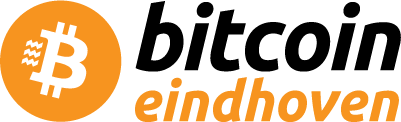
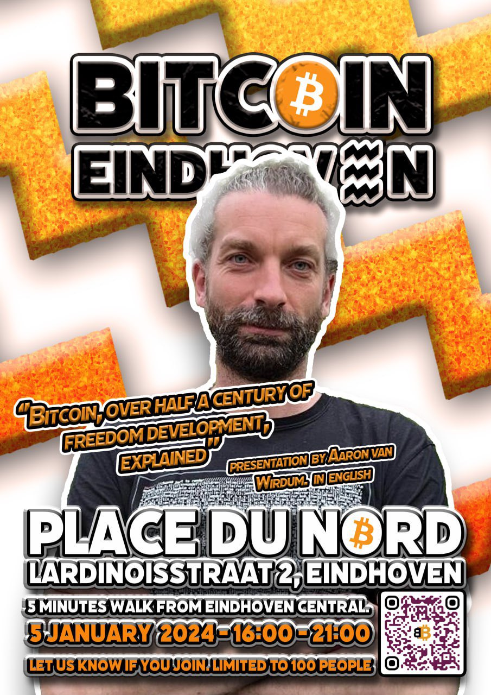
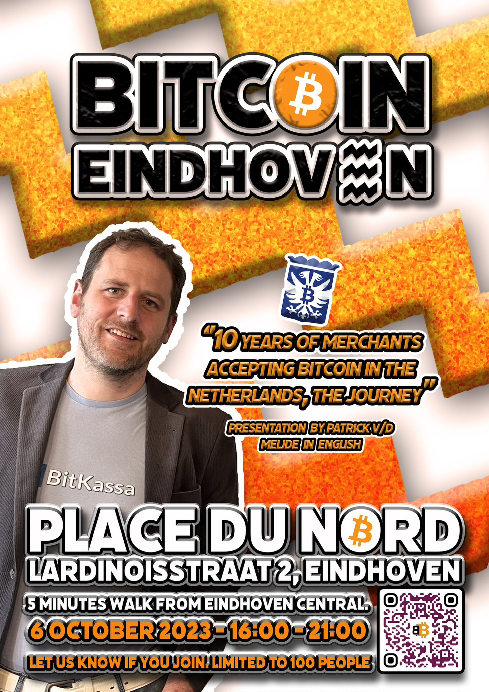

{.header}

Bitcoin meetup Eindhoven. We discuss, help and enjoy talking about bitcoin every first Friday of every quarter.

## Meetup.com

Join us on Meetup.com: [Bitcoin meetup Eindhoven](https://www.meetup.com/bitcoineindhoven/)

## Upcoming events

- ### 2024-01-05 Meetup #2 Place du Nord Eindhoven
    
    
    
    Every first Friday of the quarter some bitcoiners meet in the wild. There is a presentation by Aaron van Wirdum with the title "Bitcoin, over half a century of freedom development, explained". The presentation will be given in English. Half an hour presentation and half hour questions. After this informative hour you can enjoy food and drinks and pay with bitcoin.

    Free parking: Rosa Manusstraat (be careful, there are also paid parts of that street)

    It’s a 5 minutes walk from the central station of Eindhoven.

    ---

## Past events

- ### 2023-10-06 Meetup #1 Place du Nord Eindhoven
    
    

    Every first Friday of the quarter some bitcoiners meet in the wild. There is a presentation by Patrick van der Meijde, who started bitkassa and bitcoin city Arnhem a decade ago. The presentation “10 years of merchants accepting bitcoin in the netherlands, the journey” will be given in English. Half an hour presentation and half hour questions. After this informative hour you can enjoy food and drinks and pay with bitcoin.

    Free parking: Rosa Manusstraat (be careful, there are also paid parts of that street)

    It’s a 5 minutes walk from the central station of Eindhoven.

    ---

- ### 2023-07-07 Meetup #0 BeanBrothers Stadsbranderij Eindhoven
    
    Every first Friday of the quarter some bitcoiners meet in the wild. Enjoy and pay with bitcoin at the coffee place.

    ---
