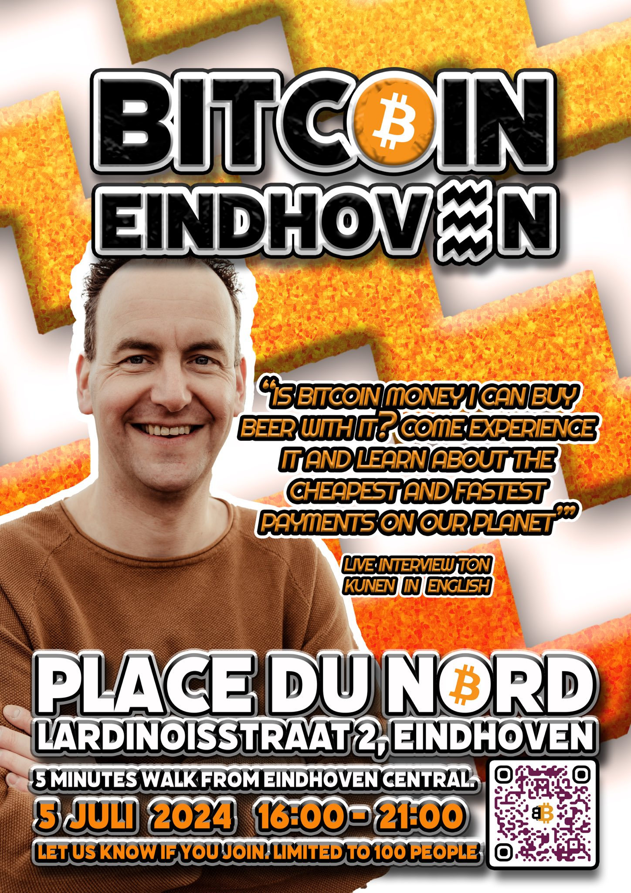

{#logo}

Bitcoin meetup Eindhoven. We discuss, help and enjoy talking about bitcoin every first Friday of every quarter.

## Meetup.com

Join us on Meetup.com: [Bitcoin meetup Eindhoven](https://www.meetup.com/bitcoineindhoven/)

## Upcoming events

- ### 2025-04-04 Meetup #7 Place du Nord Eindhoven

    Every first Friday of the quarter some bitcoiners meet in the wild at the Bitcoin Eindhoven Meetup. As from 16h00 the venue is open and first bitcoiners will be present. This time there will be an interview with *Alles voor Bitcoin* podcast host *Kim de Vos*, starting at 18h30.

    You can enjoy food and drinks and pay with bitcoin.

    Parking garage almost underneath the venue. It’s a 5 minutes walk from the central station of Eindhoven.

    ---
    
## Past events

- ### 2025-01-03 Meetup #6 Place du Nord Eindhoven

	Every first Friday of the quarter some bitcoiners meet in the wild.

	There is a celebration of bitcoin's sixteenth year of operation on genesis block day. To celebrate this we will view the amazing VPRO documentary about bitcoin that is a decade old now. The bitcoin price was just a couple hundred $. After the screening you can enjoy food and drinks and pay with bitcoin.

	Parking garage almost underneath the venue. It’s a 5 minutes walk from the central station of Eindhoven.
    
    ---

- ### 2024-10-11 Meetup #5 Place du Nord Eindhoven

	Normally every first Friday of the quarter some bitcoiners meet in the wild. This time it’ll be on the second friday. This is due to the combination of the antwerp and amsterdam conference during this week. The mining workshop on the 12th of october and this meetup on the 11th fit much better in the conference schedule. Eindhoven is also easily reachable from Amsterdam.

	There is an interview and QnA with Jelmer ten Wolde. The title of the interview “Why heat recovery and load balancing are critical to survive the bitcoin mining future". Half an hour interview and half hour questions. After this informative hour you can enjoy food and drinks and pay with bitcoin. Parking garage almost underneath the venue. It’s a 5 minutes walk from the central station of Eindhoven.

    ---

- ### 2024-07-05 Meetup #4 Place du Nord Eindhoven

    

    Every first Friday of the quarter some bitcoiners meet in the wild. There is an interview and QnA with Lightning Checkout and currently a still unconfirmed mystery guest. The title of our interview "Lightning, is it the future of payments?". Half an hour interview and half hour questions. After this informative hour you can enjoy food and drinks and pay with bitcoin.

    Parking garage almost underneath the venue.

    It’s a 5 minutes walk from the central station of Eindhoven.

    ---

- ### 2024-04-05 Meetup #3 Place du Nord Eindhoven

    

    Every first Friday of the quarter some bitcoiners meet in the wild. There is an interview and QnA with Gurtis Pleb with the title "How are we going to build our bitcoin citadel?". Half an hour interview and half hour questions. After this informative hour you can enjoy food and drinks and pay with bitcoin.

    Parking garage almost underneath the venue.

    It’s a 5 minutes walk from the central station of Eindhoven.

    ---

- ### 2024-01-05 Meetup #2 Place du Nord Eindhoven

    

    Every first Friday of the quarter some bitcoiners meet in the wild. There is a presentation by Aaron van Wirdum with the title "Bitcoin, over half a century of freedom development, explained". The presentation will be given in English. Half an hour presentation and half hour questions. After this informative hour you can enjoy food and drinks and pay with bitcoin.

    Free parking: Rosa Manusstraat (be careful, there are also paid parts of that street)

    It’s a 5 minutes walk from the central station of Eindhoven.

    ---

- ### 2023-10-06 Meetup #1 Place du Nord Eindhoven

    

    Every first Friday of the quarter some bitcoiners meet in the wild. There is a presentation by Patrick van der Meijde, who started bitkassa and bitcoin city Arnhem a decade ago. The presentation “10 years of merchants accepting bitcoin in the netherlands, the journey” will be given in English. Half an hour presentation and half hour questions. After this informative hour you can enjoy food and drinks and pay with bitcoin.

    Free parking: Rosa Manusstraat (be careful, there are also paid parts of that street)

    It’s a 5 minutes walk from the central station of Eindhoven.

    ---

- ### 2023-07-07 Meetup #0 BeanBrothers Stadsbranderij Eindhoven

    Every first Friday of the quarter some bitcoiners meet in the wild. Enjoy and pay with bitcoin at the coffee place.

    ---
